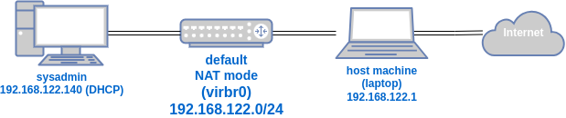

# Lab 00 - Setup KVM/QEMU/libvirt

This lab covers the installation and configuration of the KVM/QEMU/libvirt virtualization stack on a Kubuntu laptop. This setup will serve as the foundation for subsequent labs.

## Steps

### Step 01: Check If System Is Capable of Virtualization
Before installing any virtualization software, confirm that your system supports hardware virtualization.

1. Run the following command to check CPU virtualization support:
   ```bash
   egrep -c '(vmx|svm)' /proc/cpuinfo
   ```
   - If the output is `0`, your system may not support hardware virtualization, or it might need to be enabled in the BIOS/UEFI.
   - If the output is `1` or higher, virtualization is supported.

### Step 02: Install Virtualization Packages
Install the necessary packages for KVM, QEMU, and libvirt.

1. Update package lists:
   ```bash
   sudo apt update
   ```
2. Install the required packages:
   ```bash
   sudo apt install -y qemu-kvm libvirt-daemon-system libvirt-clients bridge-utils virt-manager
   ```
   - `qemu-kvm`: Provides KVM and QEMU for virtualization.
   - `libvirt-daemon-system`: Manages virtual machines using libvirt.
   - `libvirt-clients`: Offers command-line tools for managing VMs.
   - `bridge-utils`: Allows for network bridging, useful for VM networking.
   - `virt-manager`: GUI tool to manage VMs.

### Step 03: Start and Manage libvirtd Service
Start the libvirt daemon and verify that it runs correctly.

1. Enable and start the `libvirtd` service:
   ```bash
   sudo systemctl enable --now libvirtd
   ```
2. Verify the service status:
   ```bash
   systemctl status libvirtd
   ```
   - Ensure the service is active and running.

### Step 04: Use System libvirtd
Configure the system to allow user management of the system-wide `libvirtd` instance.

1. Add your user to the `libvirt` group to gain access to `libvirtd` without using `sudo`:
   ```bash
   sudo usermod -aG libvirt $(whoami)
   ```
   - **Note**: You’ll need to log out and log back in for this change to take effect.

2. Set the `VIRSH_DEFAULT_CONNECT_URI` environment variable to `qemu:///system` for system-wide access by default:
   ```bash
   echo 'export VIRSH_DEFAULT_CONNECT_URI=qemu:///system' >> ~/.bashrc
   ```

3. Apply the change by sourcing the `.bashrc` file:
   ```bash
   source ~/.bashrc
   ```

4. Ensure the default virtual network is running:
   ```bash
   virsh net-start default
   ```
   - You should see a message indicating the network is active. If it's already running, you’ll see a message indicating it’s already active.

5. Check the host machine’s network interfaces for the default network (virbr0):
   ```bash
   ip a | grep virbr0
   ```
   - This command should display information about the `virbr0` interface, which is used for the default virtual network.

### Step 05: Create First VM

In this step, we’ll create a virtual machine using Fedora Linux Workstation.

1. **Download Fedora Linux Workstation ISO**:
   - Go to the [Fedora Workstation download page](https://fedoraproject.org/workstation/download).
   - In the "For Intel and AMD x86_64 systems" section, download the ISO file for Fedora Linux Workstation edition.

2. **Create a New Virtual Machine in virt-manager**:
   - Open `virt-manager` from the application menu or by running:
     ```bash
     virt-manager
     ```
   - Click **File > New Virtual Machine**.
   - Choose **Local install media (ISO image or CDROM)**, then select the Fedora ISO you downloaded.
   - Set the name of the virtual machine to **sysadmin**.

3. **Configure VM Resources**:
   - Set **Memory** to **4096 MB** (4 GB).
   - Set **CPU** to **2**.
   - Set **Storage** to **20 GB** disk size (default or manually set if needed).

4. **Complete the Initial Setup**:
   - Go through the installation prompts for Fedora Linux Workstation.
   - Once the installation is complete, restart the VM when prompted.

5. **Finish Setup**:
   - After restarting, follow the on-screen instructions to create a superuser:
     - **Username**: `vmadmin`
     - **Password**: Choose a secure password.
   - Set the **hostname** to `sysadmin`.

With these steps completed, you should have a Fedora Linux virtual machine ready for use.

### Step 06: Test Networking

In this step, verify network connectivity between the host machine and the `sysadmin` VM.

1. **Ping an External Website from the VM**:
   - Open a terminal in the `sysadmin` VM and run:
     ```bash
     ping -c 4 google.com
     ```
   - This command should show successful ping responses if the VM has internet access.

2. **Check the Public IP for the VM**:
   - In the VM, use `curl` to check the public IP:
     ```bash
     curl ifconfig.me
     ```
   - This command should display the public IP address assigned to the VM.

3. **Use tcpdump to Capture Ping Packets**:
   - On the host machine, open a terminal and run the following command to capture ICMP (ping) packets:
     ```bash
     sudo tcpdump -i virbr0 icmp
     ```
   - In the VM, open a terminal and run:
     ```bash
     sudo tcpdump -i <interface> icmp
     ```
     - Replace `<interface>` with the VM’s network interface (usually something like `ens3` or `eth0`).

4. **Ping the Host Machine from the VM**:
   - In the VM, ping the host machine’s IP address:
     ```bash
     ping -c 4 <host_ip>
     ```
     - Replace `<host_ip>` with the IP address of the `virbr0` interface on the host machine.
   - Verify that the `tcpdump` command on both the host and VM terminals shows ICMP packets.

This step demonstrates that the host machine and the VM are connected and can communicate over the default virtual network.

## Network Diagram
Here's a drawio diagram of this initial network setup.
