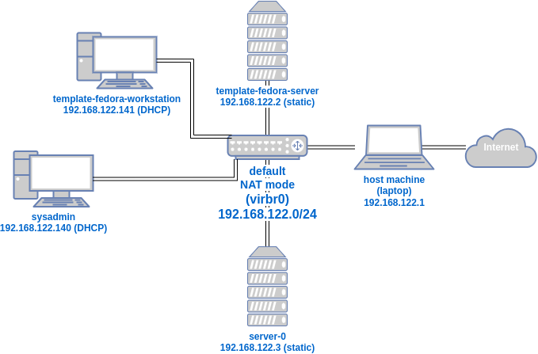

# Lab 01 - Create VM Templates

In this lab, we'll create template VMs for both Fedora Server and Fedora Workstation editions. These templates will be used to quickly set up new VMs with predefined configurations.

## Steps

### Step 01 - Create `template-fedora-server`

In this step, we will create a Fedora Server template VM with a static IP address.

1. **Download Fedora Linux Server ISO**:
   - Go to the [Fedora Server download page](https://fedoraproject.org/server/download).
   - In the "For Intel and AMD x86_64 systems" section, download the ISO file for Fedora Linux Server edition.

2. **Create a New Fedora Server VM in virt-manager**:
   - Open `virt-manager` and create a new virtual machine, following the steps used in Lab 00.
   - Set the VM name to **template-fedora-server**.
   - Configure the VM resources as desired (e.g., 2 GB memory, 1 CPU, and 20 GB disk space).

3. **Assign a Static IP Address**:
   - During the network configuration step of the installation, set a static IP address:
     - **IP Address**: `192.168.122.2/24`
     - **DNS and Gateway**: `192.168.122.1` (default network gateway IP)

4. **Complete Installation and Restart**:
   - Finish the Fedora Server installation and restart the VM.

5. **Test Network Connectivity**:
   - On the `sysadmin` VM, test connectivity to `template-fedora-server` by its static IP:
     ```bash
     ping -c 4 192.168.122.2
     ```
   - On `template-fedora-server`, test connectivity to `sysadmin` by both IP and hostname:
     ```bash
     ping -c 4 192.168.122.1
     ```
     ```bash
     ping -c 4 sysadmin
     ```
     - **Explanation**: The `sysadmin` VM can be pinged by hostname because it uses DHCP, and libvirt’s DNS/DHCP service resolves the hostname automatically. However, because `template-fedora-server` has a static IP, other VMs can’t ping it by hostname unless you manually add an entry in the default virtual network’s DNS configuration.

6. **Optional: Add DNS Entry for `template-fedora-server`**:
   - Edit the default network definition to add a DNS entry for `template-fedora-server`:
     ```bash
     sudo virsh net-edit default
     ```
   - Add a `<host>` entry under the `<dns>` section:
     ```xml
     <host ip='192.168.122.2'>
       <hostname>template-fedora-server</hostname>
     </host>
     ```
   - Restart the default network for changes to take effect:
     ```bash
     sudo virsh net-destroy default
     ```

     ```bash
     sudo virsh net-start default
     ```
   - After this change, other VMs connected to the network should restart (to use the new network instance) and be able to ping `template-fedora-server` by hostname.

### Step 02 - Clone `template-fedora-server`

In this step, we will clone the Fedora Server template VM to create a new VM instance.

1. **Clone the Template VM**:
   - In `virt-manager`, right-click `template-fedora-server` and select **Clone**.
   - Name the clone **server-0**.

2. **Configure the New VM**:
   - Start `server-0` and open a terminal.

3. **Update Hostname**:
   - Change the hostname to `server-0` using `hostnamectl`:
     ```bash
     sudo hostnamectl set-hostname server-0
     ```

4. **Change IP Address**:
   - Use `nmcli` to set a new static IP for `server-0`:
     ```bash
     sudo nmcli con mod <connection_name> ipv4.addresses "192.168.122.3/24" ipv4.gateway "192.168.122.1" ipv4.dns "192.168.122.1" ipv4.method manual
     ```

     And restart the network connection:
     ```bash
     sudo nmcli con up <connection_name>
     ```
     - Replace `<connection_name>` with the actual name of the network connection (e.g., `Wired connection 1`). You can find it using:
       ```bash
       nmcli con show
       ```

5. **Test Network Connectivity**:
   - On the `sysadmin` VM, ping both `template-fedora-server` and `server-0` to confirm they are reachable:
     ```bash
     ping -c 4 192.168.122.2  # template-fedora-server
     ```
     ```bash
     ping -c 4 192.168.122.3  # server-0
     ```
   - This demonstrates that both the template and cloned VM have unique IP addresses and are accessible on the network.

### Step 03 - Create `template-fedora-workstation`

In this step, we will create a Fedora Workstation template VM by cloning the existing `sysadmin` VM.

1. **Clone `sysadmin` to Create `template-fedora-workstation`**:
   - In `virt-manager`, right-click the `sysadmin` VM and select **Clone**.
   - Name the clone **template-fedora-workstation**.

2. **Update Hostname**:
   - Start `template-fedora-workstation` and open a terminal.
   - Change the hostname to `template-fedora-workstation` using `hostnamectl`:
     ```bash
     sudo hostnamectl set-hostname template-fedora-workstation
     ```
3. **Disable systemd-resolved**:
   By default, Fedora Linux workstation and server uses the `systemd-resolved` service to manage DNS resolution. In labs, I've found that using the `NetworkManager` service to manage the `/etc/resolv.conf` file instead of the `systemd-resolved` service simplifies the DNS resolution.
   - Disable and stop the `systemd-resolved` service:
     ```bash
     sudo systemctl disable --now systemd-resolved.service
     ```
   - Unlink the `/etc/resolv.conf` file:
     ```bash
     sudo unlink /etc/resolv.conf
     ```
   - Restart the network service to recreate the `/etc/resolv.conf` file:
     ```bash
     sudo systemctl restart NetworkManager
     ```
   - Check that the `/etc/resolv.conf` file uses the `default` network's IP address `192.168.122.1` for the `nameserver` setting:
     ```bash
     cat /etc/resolv.conf
     ```
      It should have this:
      ```
      # Generated by NetworkManager
      nameserver 192.168.122.1
      ```

4. **Verify DHCP Leases**:
   - Check the DHCP leases to confirm that both `sysadmin` and `template-fedora-workstation` are listed with different IP addresses:
     ```bash
     virsh net-dhcp-leases default
     ```
   - The output should display separate entries for `sysadmin` and `template-fedora-workstation`, showing that they are uniquely identified on the network.

With these steps, the Fedora Server and Workstation template VMs are ready for further use in new VM setups.

## Network Diagram
Here's a drawio diagram of the network setup, with all the templates and VMs connected to the same default virtual network.
